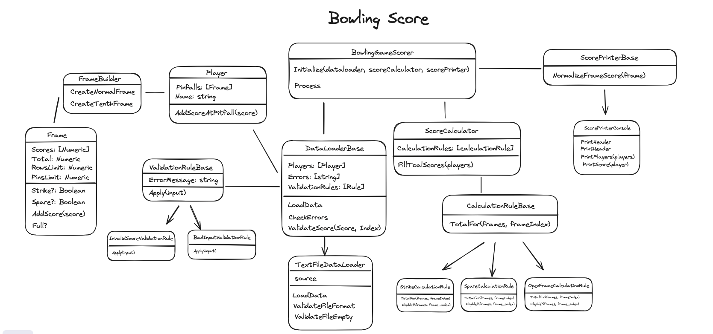

## Assignment

The goal of this exercise is to demonstrate your ability to build a greenfield project, specifically a command-line application to score a game of ten-pin bowling. You can find the rules [here](https://en.wikipedia.org/wiki/Ten-pin_bowling#Rules_of_play).

The code should handle the bowling scores rules described in the specs and [here](https://www.youtube.com/watch?v=aBe71sD8o8c).

## Mandatory Features
 - You will need to **record a video explaining the code** you created, the decisions you made, its functionality, and demonstrating the complete operation of the challenge. _Remember to show the execution from scratch, it should not be running beforehand._

- The program should run from the command-line and take a text file as input

- The program should read the input text file and parse its content, which should have the results for several players bowling 10 frames each, written according to these guidelines:

1. Each line represents a player and a chance with the subsequent number of pins knocked down.
2. An 'F' indicates a foul on that chance and no pins knocked down (identical for scoring to a roll of 0).
3. The columns in each row are tab-separated.

Example:

```
Jeff 10
John 3
John 7
Jeff 7
Jeff 3
John 6
John 3
Jeff 9
Jeff 0
John 10
Jeff 10
John 8
John 1
Jeff 0
Jeff 8
John 10
Jeff 8
Jeff 2
John 10
Jeff F
Jeff 6
John 9
John 0
Jeff 10
John 7
John 3
Jeff 10
John 4
John 4
Jeff 10
Jeff 8
Jeff 1
John 10
John 9
John 0
```

You can find more examples in the tests folder.

- The program should handle bad input like more than ten throws (i.e., no chance will produce a negative number of knocked down pins or more than 10, etc), invalid score value or incorrect format

- The program should output the scoring for the associated game according to these guidelines:

1. For each player, print their name on a separate line before printing that player's pinfalls and score.
2. All values are tab-separated.
3. The output should calculate if a player scores a strike ('X'), a spare ('/') and allow for extra chances in the tenth frame.

Your program should be able to handle all possible cases of a game both including a game where all rolls are 0, all rolls are fouls (F) and a perfect game, where all rolls are strikes:

```
Carl 10
Carl 10
Carl 10
Carl 10
Carl 10
Carl 10
Carl 10
Carl 10
Carl 10
Carl 10
Carl 10
Carl 10
```

- Unit test: Tests should cover at least the non-trivial classes and methods

- Integration test: At least cover the three main cases: Sample input (2 players), perfect score, zero score


## Considerations

* SRP: Single Responsibility Principle (Classes are self contained. They do the task they need to do and nothing else).
* Liskov’s Substitution Principle: Interfaces (OOP, Swap principle... Makes the program able to be extended).
* Dependency Inversion Principle: Code should depend on interfaces, no concrete implementations.
* Coupled code: If code has too few classes we should not accept this candidate, even if the program works perfectly. Code violates SRP, classes demonstrate mixed concerns. Bad OOP in general.
* Abuse of class methods and singleton: Usually this indicates a junior candidate since this makes difficult to use the Substitution Principle.
* Duplicated code: Reused code should be encapsulated.
* Include well-known libraries.
* Complete the readme file explaining how to compile the project, and contain the test text file to check the output
* Project structure: It should be the standard Ruby project layout, no IDE specific or
custom.

----

## Requirements

```shell
  ruby 2.7.3
```

## Specifications

- [X] You will need to **record a video explaining the code** you created, the decisions you made, its functionality, and demonstrating the complete operation of the challenge. _Remember to show the execution from scratch, it should not be running beforehand._
- [X] The program should run from the command-line and take a text file as input;
- [X] The program should read the input text file and parse its content;

### Rules
- [ ] An 'F' indicates a foul on that chance and no pins knocked down (identical for scoring to a roll of 0).
- [ ] strike (X): knock down all 10 pins on the first roll. The frame receives ten pins plus a bonus of pinfall on the next two rolls.
- [ ] spare (/): when a second roll of a frame is needed to knock down all ten pins. The frame receives ten pins plus a bonus of pinfall in the next roll.
- [ ] open frame: the frame is scored with the total number of pins knocked down.
- [ ] tenth Frame: A strike receives two extra rolls for bonus pins.
- [ ] tenth Frame: A spare in the first two rolls receives a third roll for bonus pins.

- [ ] The program should handle bad input
  - [x] negative number of knocked down pins
  - [x] more than 10 on knocked down pins
  - [X] invalid score value or incorrect format
  - [ ] like more than ten throws
  - [X] invalid format file
  - [X] empty file
  - [X] accept F as a valid score

## Setup Ruby (only if you have not installed)

This project uses [asdf](https://asdf-vm.com/guide/getting-started.html). \
Follow the installation [instructions](https://asdf-vm.com/guide/getting-started.html#_3-install-asdf)

After installation you need to follow these steps:

```bash
# Add ruby plugin on asdf
$ asdf plugin add ruby https://github.com/asdf-vm/asdf-ruby.git

# Install ruby plugin
$ asdf install ruby 2.7.3
```

## Setup Project

```bash
# install bundler
$ gem install bundler

# run bundle to install gems
$ bundle
```

## Available Tasks

```bash
# run all tests of the project
$ bundle exec rspec

# run linter
$ bundle exec rubocop
```

## Decisions

The explanations are in this video -> https://www.loom.com/share/a216ae25ca1247e1b7d1856a335306f0?sid=4c12a889-9615-4888-b11a-d3aa9190e7b1

## Modeling



Modeling updates:
  - The Base for DataLoad instead receive the source on load data method, just defines load data and let the concrete class initializer be responsible for the source;
  - Join invalid score and negative score in just one validator;
  - Create Frame class and add new methods to self manage when the scores is full;
  - Create Player class and add new method to self manage when need to add new frame or use the last frame added;
